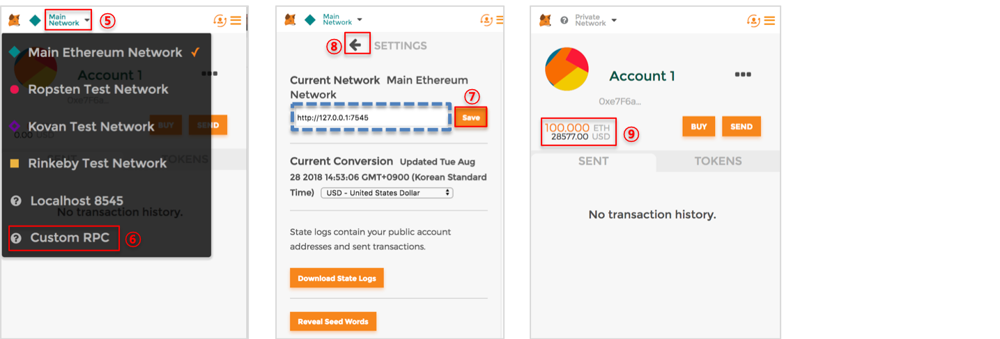
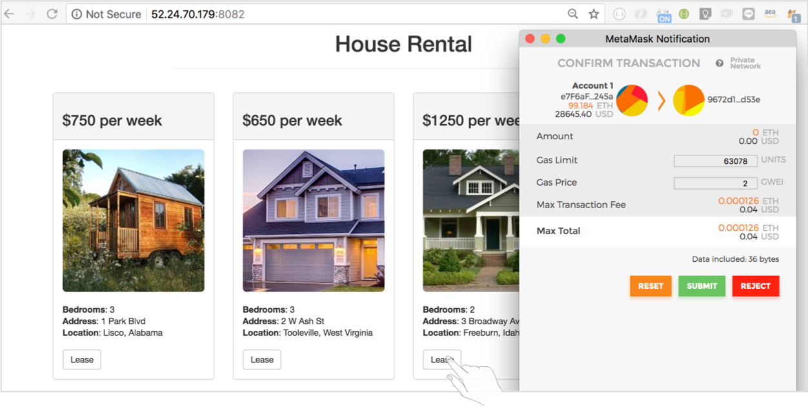

# 'House Rental' 구현하기
Truffle과 Ganache(TestRPC)를 이용하여 손쉽게 Smart Contract 구현 및 배포하고 간단한 Dapp 애플리케이션을 구동시켜보는 실습입니다.

&nbsp;
## Part 1: 개발 환경 설정
### 1.1. Install the prerequisites

- NPM : https://nodejs.org
- Truffle : https://github.com/trufflesuite/truffle
- Ganache : http://truffleframework.com/ganache/
- IDE: (eg. Intelij, Eclipse, WinStorm, Visual Studio etc.)
- (Optional) IDE에 맞는 Solidity 플러그인 추가 
- Metamask : https://metamask.io/


### 1.2. Project 디렉토리 생성하기
```
$ mkdir house-rental
$ cd house-rental
```

### 1.3. Truffle Scaffolding 
```
$ truffle unbox pet-shop
```

✔︎ 다음과 같은 결과가 출력됩니다.
```
Downloading...
Unpacking...
Setting up...
Unbox successful. Sweet!

Commands:

  Compile:        truffle compile
  Migrate:        truffle migrate
  Test contracts: truffle test
  Run dev server: npm run dev
```

### 1.4.(Optional) 불필요한 파일 삭제하기
아래 이미지를 삭제합니다. (미사용)
```
$ rm box-img-lg.png
$ rm box-img-sm.png
$ rm -rf src/images/*.jpeg
$ rm src/pets.json
```

index.html과 app.js도 삭제합니다. (나중에 다른 내용으로 대체)
```
$ rm src/index.html
$ rm src/js/app.js
```

## Part 2: Smart Contract 생성 / 컴파일 및 배포 / 테스트
### 2.1. Smart Contract 작성하기
```
$ vi contracts/LeaseProperty.sol
```

코드를 아래와 같이 수정하세요.
```solidity
pragma solidity ^0.4.24;

contract LeaseProperty {

    address[16] public lessees;

    // Lease a property
    function lease(uint propertyId) public returns (uint) {
        require(propertyId >= 0 && propertyId <= 15);
        lessees[propertyId] = msg.sender;
        return propertyId;
    }

    // Retrieving the lessees
    function getLessees() public view returns (address[16]) {
        return lessees;
    }
}
```

### 2.2. Smart Contract 컴파일
```
$ truffle compile
```

✔︎ 다음과 같은 결과가 출력됩니다.
```
Compiling ./contracts/LeaseProperty.sol...
Compiling ./contracts/Migrations.sol...
Writing artifacts to ./build/contracts
```

### 2.3. 마이그레이션 코드 작성하기
```
$ vi migrations/2_deploy_contracts.js
```

코드를 아래와 같이 수정하세요.
```javascript
var LeaseProperty = artifacts.require("./LeaseProperty.sol");

module.exports = function(deployer) {
  deployer.deploy(LeaseProperty);
};
```
> Migrations/ 폴더에 default로 1_initial_migration.js 파일이 존재합니다. 
> 이 파일은 Migrations.sol 컨트랙트의 배포를 관리하며, 변경되지 않은 컨트랙트를 이중 마이그레이션하지 않도록 보장합니다. 

### 2.4. Ganache 실행하기 (개발환경)

Smart Contract를 블록체인에 마이그레이션(배포)하기 전에 먼저 블록체인을 실행해야합니다. 
여기서는 개발 환경으로 Ganache (TestRPC)를 사용합니다.

### 2.5. Smart Contract 마이그레이션하기 (Ganache)
```
$ truffle migrate 
```
> truffle.js파일에서 networks에 'development' 정보를 읽어 로컬 Ganache에 연결됩니다.

✔︎ 다음과 같은 결과가 출력됩니다.
```
Using network 'development'.

Running migration: 1_initial_migration.js
  Deploying Migrations...
  ... 0xb191d286c9a2fcab68b1218cafc7c40477b3c5c4e5987582b7b53004ae776c5a
  Migrations: 0x534774eee39ec144dd188399cfb0a49b63c2c005
Saving successful migration to network...
  ... 0x8c282e8b29cb0692ec8d37a36d43986dfbdd684c3af92db6b1f7b6f531e36317
Saving artifacts...
Running migration: 2_deploy_contracts.js
  Deploying LeaseProperty...
  ... 0x0804a39647b115bf060cd269feff909564e8aac975ba3860c2165bcff73e8f0e
  LeaseProperty: 0xfa124fc5290ac561b69bcf8a23d4128e7ac22e5d
Saving successful migration to network...
  ... 0x0d35af9affae169a12bb8cddaca285dc5a0ab2599cc60b46ebea8c1e70e2b0fb
Saving artifacts...
```

### 2.6. Ganache에서 블록체인의 상태가 변경 확인하기
 
Ganache를 통해 블록체인의 상태가 변경된 것을 확인합니다. 
현재 블록이 이전에 0이었는데 블록이 4로 변경된 되고, 첫 번째 계정의 원래 100 ETH였지만 마이그레이션하는 데 드는 트랜잭션 비용으로 인해 이제는 더 낮아졌습니다.


### 2.7. Tests용 신규 파일 생성하기
```
$ vi test/TestLeaseProperty.sol
```
코드를 아래와 같이 수정하세요.
```solidity
pragma solidity ^0.4.24;

import "truffle/Assert.sol";
import "truffle/DeployedAddresses.sol";
import "../contracts/LeaseProperty.sol";

contract TestLeaseProperty {
    LeaseProperty leaseProperty = LeaseProperty(DeployedAddresses.LeaseProperty());

    // Testing the lease() function
    function testUserCanLeaseProperty() public {
        uint returnedId = leaseProperty.lease(8);
        uint expected = 8;
        Assert.equal(returnedId, expected, "Lease of property ID 8 should be recorded.");
    }

    // Testing retrieval of a single property's owner
    function testGetLesseeAddressByPropertyId() public {
        // Expected owner is this contract
        address expected = this;
        address lessee = leaseProperty.lessees(8);
        Assert.equal(lessee, expected, "Owner of property ID 8 should be recorded.");
    }

    // Testing retrieval of all lessors
    function testGetLesseeAddressByPropertyIdInArray() public {
        // Expected owner is this contract
        address expected = this;
        // Store lessees in memory rather than contract's storage
        address[16] memory lessees = leaseProperty.getLessees();
        Assert.equal(lessees[8], expected, "Owner of property ID 8 should be recorded.");
    }
}
```
### 2.8. Test 실행하기
```
$ truffle test
```

✔︎ 만일 모든 테스트가 통과되면, 다음과 같은 결과가 출력됩니다.
```
Using network 'development'.

Compiling ./contracts/LeaseProperty.sol...
Compiling ./test/TestLeaseProperty.sol...
Compiling truffle/Assert.sol...
Compiling truffle/DeployedAddresses.sol...


  TestLeaseProperty
    ✓ testUserCanLeaseProperty (131ms)
    ✓ testGetLesseeAddressByPropertyId (131ms)
    ✓ testGetLesseeAddressByPropertyIdInArray (147ms)


  3 passing (1s)
```


## Part 3: Smart Contract와 상호 작용하는 사용자 인터페이스 만들기
### 3.1. app.js 파일 수정하기 
```
$ vi src/js/app.js
```

코드를 아래와 같이 수정하세요.
```javascript
App = {
  web3Provider: null,
  contracts: {},

  init: function() {
    // Load properties.
    $.getJSON('../properties.json', function(data) {
      var propertiesRow = $('#propertiesRow');
      var propertyTemplate = $('#propertyTemplate');

      for (i = 0; i < data.length; i ++) {
        propertyTemplate.find('.panel-amount').text(data[i].amount);
        propertyTemplate.find('img').attr('src', data[i].picture);
        propertyTemplate.find('.property-address').text(data[i].address);
        propertyTemplate.find('.property-bedrooms').text(data[i].bedrooms);
        propertyTemplate.find('.property-location').text(data[i].location);
        propertyTemplate.find('.btn-lease').attr('data-id', data[i].id);

        propertiesRow.append(propertyTemplate.html());
      }
    });

    return App.initWeb3();
  },

  initWeb3: function() {
    // Is there an injected web3 instance?
    if (typeof web3 !== 'undefined') {
      App.web3Provider = web3.currentProvider;
    } else {
      // If no injected web3 instance is detected, fall back to Ganache
      App.web3Provider = new Web3.providers.HttpProvider('http://localhost:7545');
    }
    web3 = new Web3(App.web3Provider);
    return App.initContract();
  },

  initContract: function() {
    $.getJSON('LeaseProperty.json', function(data) {
      // Get the necessary contract artifact file and instantiate it with truffle-contract
      var LeasePropertyArtifact = data;
      App.contracts.LeaseProperty = TruffleContract(LeasePropertyArtifact);

      // Set the provider for our contract
      App.contracts.LeaseProperty.setProvider(App.web3Provider);

      // Use our contract to retrieve and mark the leased properties
      return App.markLeased();
    });

    return App.bindEvents();
  },

  bindEvents: function() {
    $(document).on('click', '.btn-lease', App.handleLease);
  },

  markLeased: function(lessees, account) {
    var leasePropertyInstance;

    App.contracts.LeaseProperty.deployed().then(function(instance) {
      leasePropertyInstance = instance;

      return leasePropertyInstance.getLessees.call();
    }).then(function(lessees) {
      for (i = 0; i < lessees.length; i++) {
        if (lessees[i] !== '0x0000000000000000000000000000000000000000') {
          $('.panel-property').eq(i).find('button').text('Purchased').attr('disabled', true);
        }
      }
    }).catch(function(err) {
      console.log(err.message);
    });
  },

  handleLease: function(event) {
    event.preventDefault();

    var propertyId = parseInt($(event.target).data('id'));

    var leasePropertyInstance;

    web3.eth.getAccounts(function(error, accounts) {
      if (error) {
        console.log(error);
      }

      var account = accounts[0];
      
      App.contracts.LeaseProperty.deployed().then(function(instance) {
        leasePropertyInstance = instance;

        // Execute lease as a transaction by sending account
        return leasePropertyInstance.lease(propertyId, {from: account});
      }).then(function(result) {
        return App.markLeased();
      }).catch(function(err) {
        console.log(err.message);
      });
    });
  }
};

$(function() {
  $(window).load(function() {
    App.init();
  });
});
```
> - app.js에서 포함된 내용
>  - web3 인스턴스 정의
>  - contract 인스턴스 정의
>  - Properties.json에서 House 정보를 읽어 UI 업데이트
>  - lease() 함수 처리

### 3.2. the index.html 파일 수정하기
```
$ vi src/index.html
```

코드를 아래와 같이 수정하세요.
```html
<!DOCTYPE html>
<html lang="en">
  <head>
    <meta charset="utf-8">
    <meta http-equiv="X-UA-Compatible" content="IE=edge">
    <meta name="viewport" content="width=device-width, initial-scale=1">
    <!-- The above 3 meta tags *must* come first in the head; any other head content must come *after* these tags -->
    <title>HOUSE RENTAL</title>

    <!-- Bootstrap -->
    <link href="css/bootstrap.min.css" rel="stylesheet">

    <!-- HTML5 shim and Respond.js for IE8 support of HTML5 elements and media queries -->
    <!-- WARNING: Respond.js doesn't work if you view the page via file:// -->
    <!--[if lt IE 9]>
      <script src="https://oss.maxcdn.com/html5shiv/3.7.3/html5shiv.min.js"></script>
      <script src="https://oss.maxcdn.com/respond/1.4.2/respond.min.js"></script>
    <![endif]-->
  </head>
  <body>
    <div class="container">
      <div class="row">
        <div class="col-xs-12 col-sm-8 col-sm-push-2">
          <h1 class="text-center">House Rental Lists</h1>
          <hr/>
          <br/>
        </div>
      </div>

      <div id="propertiesRow" class="row">
        <!-- PROPERTIES LOAD HERE -->
      </div>
    </div>

    <div id="propertyTemplate" style="display: none;">
      <div class="col-sm-6 col-md-4 col-lg-3">
        <div class="panel panel-default panel-property">
          <div class="panel-heading">
            <h3 class="panel-amount">$1000 per week</h3>
          </div>
          <div class="panel-body">
            
            <br/><br/>
            <strong>Bedrooms</strong>: <span class="property-bedrooms">3</span><br/>            
            <strong>Address</strong>: <span class="property-address">123 Main St</span><br/>
            <strong>Location</strong>: <span class="property-location">Warren, MI</span><br/><br/>
            <button class="btn btn-default btn-lease" type="button" data-id="0">Lease</button>
          </div>
        </div>
      </div>
    </div>

    <!-- jQuery (necessary for Bootstrap's JavaScript plugins) -->
    <script src="https://ajax.googleapis.com/ajax/libs/jquery/1.12.4/jquery.min.js"></script>
    <!-- Include all compiled plugins (below), or include individual files as needed -->
    <script src="js/bootstrap.min.js"></script>
    <script src="js/web3.min.js"></script>
    <script src="js/truffle-contract.js"></script>
    <script src="js/app.js"></script>
  </body>
</html>
```


### 3.3 properties.json 파일 생성하기
```
$ vi src/properties.json
```

코드를 아래와 같이 수정하세요.
```json
[
  {
    "id": 0,
    "amount": "$750 per week",
    "picture": "https://s3.ap-northeast-2.amazonaws.com/dapp-lease-house/images/house-00.jpeg",
    "bedrooms": 3,
    "address": "1 Park Blvd",
    "location": "Lisco, Alabama"
  },
  {
    "id": 1,
    "amount": "$650 per week",
    "picture": "https://s3.ap-northeast-2.amazonaws.com/dapp-lease-house/images/house-01.jpeg",
    "bedrooms": 3,
    "address": "2 W Ash St ",
    "location": "Tooleville, West Virginia"
  },
  {
    "id": 2,
    "amount": "$1250 per week",
    "picture": "https://s3.ap-northeast-2.amazonaws.com/dapp-lease-house/images/house-02.jpeg",
    "bedrooms": 2,
    "address": "3 Broadway Ave",
    "location": "Freeburn, Idaho"
  },
  {
    "id": 3,
    "amount": "$800 per week",
    "picture": "https://s3.ap-northeast-2.amazonaws.com/dapp-lease-house/images/house-03.jpeg",
    "bedrooms": 2,
    "address": "4 Market St",
    "location": "Camas, Pennsylvania"
  },
  {
    "id": 4,
    "amount": "$900 per week",
    "picture": "https://s3.ap-northeast-2.amazonaws.com/dapp-lease-house/images/house-04.jpeg",
    "bedrooms": 2,
    "address": "5 Cedar Rd",
    "location": "Gerber, South Dakota"
  },
  {
    "id": 5,
    "amount": "$1100 per week",
    "picture": "https://s3.ap-northeast-2.amazonaws.com/dapp-lease-house/images/house-05.jpeg",
    "bedrooms": 3,
    "address": "6 Elm St",
    "location": "Innsbrook, Illinois"
  },
  {
    "id": 6,
    "amount": "$680 per week",
    "picture": "https://s3.ap-northeast-2.amazonaws.com/dapp-lease-house/images/house-06.jpeg",
    "bedrooms": 3,
    "address": "7 Island Ave",
    "location": "Soudan, Louisiana"
  },
  {
    "id": 7,
    "amount": "$700 per week",
    "picture": "https://s3.ap-northeast-2.amazonaws.com/dapp-lease-house/images/house-07.jpeg",
    "bedrooms": 3,
    "address": "8 Imperial Ave",
    "location": "Jacksonwald, Palau"
  },
  {
    "id": 8,
    "amount": "$850 per week",
    "picture": "https://s3.ap-northeast-2.amazonaws.com/dapp-lease-house/images/house-08.jpeg",
    "bedrooms": 2,
    "address": "9 National St",
    "location": "Honolulu, Hawaii"
  },
  {
    "id": 9,
    "amount": "$1120 per week",
    "picture": "https://s3.ap-northeast-2.amazonaws.com/dapp-lease-house/images/house-09.jpeg",
    "bedrooms": 3,
    "address": "10 Commercial Rd",
    "location": "Matheny, Utah"
  },
  {
    "id": 10,
    "amount": "$900 per week",
    "picture": "https://s3.ap-northeast-2.amazonaws.com/dapp-lease-house/images/house-10.jpeg",
    "bedrooms": 2,
    "address": "11 Harrison Rd",
    "location": "Tyhee, Indiana"
  },
  {
    "id": 11,
    "amount": "$770 per week",
    "picture": "https://s3.ap-northeast-2.amazonaws.com/dapp-lease-house/images/house-11.jpeg",
    "bedrooms": 3,
    "address": "12 Jullian St",
    "location": "Windsor, Montana"
  },
  {
    "id": 12,
    "amount": "$1300 per week",
    "picture": "https://s3.ap-northeast-2.amazonaws.com/dapp-lease-house/images/house-12.jpeg",
    "bedrooms": 3,
    "address": "13 Irving Ave",
    "location": "Kingstowne, Nevada"
  },
  {
    "id": 13,
    "amount": "$450 per week",
    "picture": "https://s3.ap-northeast-2.amazonaws.com/dapp-lease-house/images/house-13.jpeg",
    "bedrooms": 4,
    "address": "14 Valley Rd",
    "location": "Sultana, Massachusetts"
  },
  {
    "id": 14,
    "amount": "$1000 per week",
    "picture": "https://s3.ap-northeast-2.amazonaws.com/dapp-lease-house/images/house-14.jpeg",
    "bedrooms": 2,
    "address": "15 Clay St",
    "location": "Broadlands, Oregon"
  },
  {
    "id": 15,
    "amount": "$900 per week",
    "picture": "https://s3.ap-northeast-2.amazonaws.com/dapp-lease-house/images/house-15.jpeg",
    "bedrooms": 2,
    "address": "16 Franklin Ave",
    "location": "Dawn, Wisconsin"
  }
]
```

## Part 4: 브라우저에서 dapp과 상호 작용
### 4.1. MetaMask 설치 및 세팅하기
- 브라우저에 MetaMask를 설치합니다. https://chrome.google.com/webstore/detail/metamask/nkbihfbeogaeaoehlefnkodbefgpgknn?hl=en
- 일단 설치가 완료되면, 주소 표시줄 옆에 MetaMask fox 아이콘을 볼수 있습니다.

- Privacy Notice를 수락하기 위해서 'Accept' 버튼을 클릭합니다.
- 그러면 사용조건(Term of Use)가 나타나며, 읽은 다음 밑으로 스크롤링 하고 역시 'Accept'를 클릭합니다.
- 이제 초기 MetaMask 화면이 나타나면 'Import Existing DEN'을 클릭합니다. 아래에 Ganache의 Mnemonic과 비밀번호를 입력하고 'OK'를 클릭합니다.


- MetaMask를 Ganache에 연결합니다. 'Main Network'가 표시된 메뉴를 클릭하고 Custom RPC를 선택하십시오.
- 'New RPC URL'상자에 http://127.0.0.1:7545를 입력하고 'Save'을 클릭합니다.
- 'Setting'옆에 있는 왼쪽 화살표를 클릭하여 페이지를 닫고 계정 페이지로 돌아갑니다.


### 4.2. dApp 구동하기
로컬 웹 서버를 시작합니다.
```
$ npm run dev
```
- dev 서버가 실행되고 dapp이 포함된 새 브라우저 탭이 자동으로 열립니다.
- dapp을 사용하기 위해 원하는 Lease 버튼을 클릭하세요.


- MetaMask를 통해 트랜잭션을 승인하라는 메시지가 자동으로 표시됩니다. SUBMIT을 클릭하여 트랜잭션을 승인합니다.
- Lease가 완료된 House의 경우 'Success'이라고 표시됩니다.

&nbsp;
## And we're all done on TestRPC!

&nbsp;

☛ AWS 운영 배포하기 https://github.com/awslego/house-rental/blob/master/README_AWS_Deploy.md